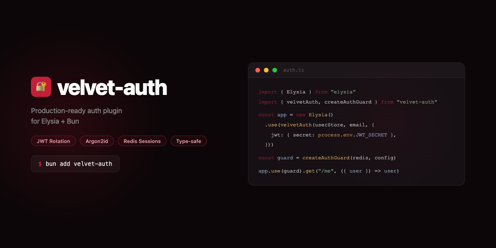

<p align="center">
  
</p>

[](https://www.npmjs.com/package/velvet-auth) [](https://www.npmjs.com/package/velvet-auth) [](https://github.com/raloonsoc/velvet-auth/blob/main/LICENSE)  

<p align="center">
  Production-ready authentication plugin for <a href="https://elysiajs.com/">Elysia</a> + <a href="https://bun.sh/">Bun</a>.<br/>
  JWT rotation · Argon2id · Redis sessions · Zero bloat.
</p>

---

## Features

| | |
|---|---|
| **JWT rotation** | Access + refresh token rotation via `httpOnly` cookies |
| **Argon2id** | Native via `Bun.password` — zero extra dependencies |
| **Redis sessions** | Refresh tokens + JTI blacklist on logout via `GETDEL` |
| **Adapter pattern** | Bring your own user store and email provider |
| **Type-safe config** | Full Zod validation with sane defaults |
| **Auth guard** | `createAuthGuard()` injects `ctx.user` on protected routes |

> **Bun-only.** Uses `Bun.password` (native Argon2id) and `Bun.Redis` (native Redis client). No extra native dependencies required.

## Requirements

- Bun >= 1.0
- Elysia >= 1.0
- Redis instance

## Installation

```sh
bun add velvet-auth
```

## Quick start

```typescript
import { Elysia } from "elysia";
import { velvetAuth } from "velvet-auth";

const app = new Elysia()
  .use(
    velvetAuth(myUserStore, myEmailAdapter, {
      jwt: {
        secret: process.env.JWT_SECRET!, // min 32 chars
      },
    }),
  )
  .listen(3000);
```

Mounts the following routes automatically:

| Method | Route | Description |
|--------|-------|-------------|
| `POST` | `/auth/register` | Create account |
| `POST` | `/auth/login` | Login |
| `POST` | `/auth/logout` | Logout + invalidate tokens |
| `POST` | `/auth/refresh` | Rotate access + refresh tokens |

## Guards

```typescript
import { createAuthGuard } from "velvet-auth";

const authGuard = createAuthGuard(redis, config);

// Requires valid JWT → injects ctx.user
app.use(authGuard).get("/me", ({ user }) => user);
```

## Configuration

```typescript
velvetAuth(userStore, emailAdapter, {
  // Required
  jwt: {
    secret: string,               // min 32 chars
    expiresIn: "15m",
  },

  // Optional — defaults shown
  redis: {
    url: "redis://localhost:6379",
  },
  tokens: {
    accessTokenTtl: 900,          // 15 min
    refreshTtl: 604800,           // 7 days
    verificationTtl: 86400,       // 24h
    otpTtl: 900,                  // 15 min
  },
  argon2: {
    memoryCost: 65536,
    timeCost: 3,
  },
  password: {
    minLength: 8,
    requireUppercase: true,
    requireNumber: true,
    requireSpecial: true,
  },
  prefix: "/auth",
  routes: {
    forgotPassword: true,
    emailVerification: true,
  },
});
```

## Custom adapters

### User store

```typescript
import type { UserStoreAdapter } from "velvet-auth";

const myUserStore: UserStoreAdapter = {
  findById: async (id) => { /* ... */ },
  findByUsername: async (username) => { /* ... */ },
  findByEmail: async (email) => { /* ... */ },
  create: async (data) => { /* ... */ },
  updatePassword: async (id, hash) => { /* ... */ },
  setEmailVerified: async (id) => { /* ... */ },
};
```

### Email adapter

```typescript
import type { EmailAdapter } from "velvet-auth";

const myEmailAdapter: EmailAdapter = {
  sendOtp: async (to, otp) => { /* ... */ },
  sendVerification: async (to, url) => { /* ... */ },
  checkStatus: async () => true,
};
```

## Types

```typescript
// Minimum shape required from a user record
interface AuthUser {
  id: string;
  username: string;
  email: string;
  password: string;      // Argon2id hash
  role: string;
  emailVerified: boolean;
}

// Injected into ctx.user by createAuthGuard
interface AuthContext {
  id: string;
  username: string;
  role: string;
  emailVerified: boolean;
}
```

## Security design

| Concern | Approach |
|---------|----------|
| Password hashing | Argon2id via `Bun.password` — native, no deps |
| Email verification | SHA-256 of a random 32-byte token, stored in Redis |
| Refresh tokens | UUID stored in Redis, consumed atomically with `GETDEL` |
| JWT revocation | JTI blacklist in Redis on logout, TTL = `accessTokenTtl` |
| Cookies | `httpOnly`, refresh token path-scoped to `/auth/refresh` |
| Anti-enumeration | `register` returns generic error for duplicate username/email |

## Error responses

```json
{
  "error": "UNAUTHORIZED",
  "message": "Unauthorized"
}
```

Codes: `UNAUTHORIZED` · `FORBIDDEN` · `NOT_FOUND` · `BAD_REQUEST` · `INTERNAL_SERVER_ERROR`

## Roadmap

- **v0.1** — Core: register, login, logout, refresh, auth guard ✓
- **v0.2** — Email flows: forgot/reset password, email verification
- **v0.3** — RBAC: `verifiedGuard`, `requiredRole`, Drizzle adapter

## License

MIT
